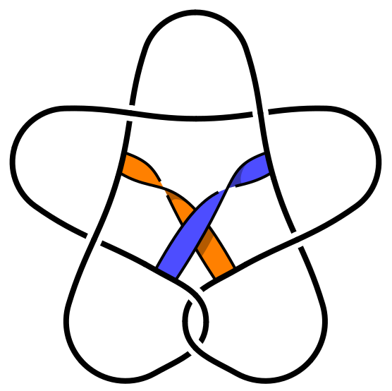
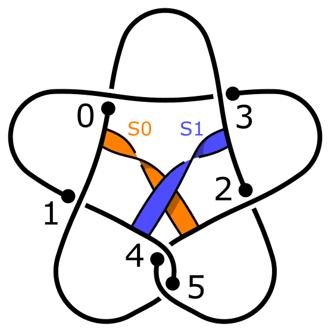

# Khovanov Cobordism Calculator

A Python module to calculate cobordism maps induced on Khovanov homology.

Written by Zsombor Fehér, 2024.

## Quick Start Guide

Example: Distinguishing two ribbon disks of 6<sub>1</sub>, given as two band diagrams on the same link diagram.



1.  Make sure you have [SciPy](https://scipy.org/) (and NumPy) installed and updated to the latest version:
    ```python
    pip install --upgrade scipy
    ```
    (Some methods require [Sage](https://www.sagemath.org/) to be installed, but tasks like this example do not.)

2.  Start a Python session, copy the file [khovanov.py](khovanov.py) to your working folder, and import that module:
    ```python
    from khovanov import *
    ```

3.  Obtain a PD code of the link, and determine how the PD code corresponds to the diagram.

    Label each crossing in your diagram with its corresponding index in the PD code.
    Mark the 0th strand of each crossing with a dot, corresponding to the 0th element of its PD code entry.
    (Since this module does not have a graphical interface yet, you might find it useful to draw the link in
    [SnapPy](https://snappy.computop.org/)'s Plink Editor, and enable Info → DT labels and Info → PD code for getting this correspondence.)

    

4.  Create a `Link` object using the PD code:
    ```python
    L = Link([(9, 4, 10, 5), (5, 8, 6, 9), (11, 2, 12, 3), (3, 10, 4, 11), (1, 7, 2, 6), (7, 1, 8, 12)])
    ```
    You can verify that your diagram is marked correctly using `print(L)`.

5.  Create the two `Cobordism` objects based on the band diagrams and your marking of crossings.

    ```python
    S0 = Cobordism(L)
    S0.band_move(-1, (0, 0), (2, 1))
    S0.finish()

    S1 = Cobordism(L)
    S1.band_move(-1, (1, 2), (3, 3))
    S1.finish()
    ```
    For example, `S1.band_move(-1, (1, 2), (3, 3))` represents a (-1)-twisted band, connecting the 1st crossing's
    2nd strand to the 3rd crossing's 3rd strand, positioned on the band's left side.
    
    You can check the resulting movie of the cobordism with `print(S0)`.

6.  Calculate the Khovanov-Jacobsson classes (`CKhElement` objects) and compare them in homology:
    ```python
    compare(S0.KJ_class(), S1.KJ_class())
    ```

7.  If this fails to distinguish the surfaces, try mirroring the cobordisms:
    ```python
    compare(S0.mirror().KJ_class(), S1.mirror().KJ_class())
    ```

## Classes overview

We provide a brief overview of the program’s classes,
highlighting key properties and methods that might be useful to users. Further details and documentation can be found in the [source code](khovanov.py).

The program builds on [SnapPy](https://snappy.computop.org/)'s `Link` class, with modifications. This class represents a link diagram combinatorially as a graph in which each vertex has degree 4 or 2.

### Crossing

A `Crossing` represents a crossing in the link diagram, modelled as a degree-4 vertex. The strands are labelled 0, 1, 2, and 3 in positive orientation around the vertex, with 0 and 2 corresponding to the understrand. Its properties:

- `adjacent` specifies the connection for each strand.
- `label` is used to identify a crossing within a `Link` (usually an integer).

For example, `a = Crossing(7)` creates a `Crossing` object with `label` 7, and connecting the strand `(a, 3)` to `(b, 0)` can be achieved by writing `a[3] = b[0]`.

### Strand

A `Strand` is similar to a `Crossing`, but represents a degree-2 vertex. While SnapPy automatically fuses these and removes unknotted unlinked components, we retain them as they are essential for representing cobordism movies.

### Link

A `Link` represents a link diagram with an enumeration of its crossings. Its property:

- `crossings` provides a list of `Crossing` and `Strand` objects that form the vertices of the graph.

Links can be created using PD codes, braid closures, or a list of `Crossing` and `Strand` objects, e.g. `L = Link([a, b, c])`. Its methods:

- `L.orient(cs0, cs1, ...)`: if the link $L$ has multiple components, it may be necessary to define its orientation to set its `n_plus` and `n_minus` properties (representing the number of positive and negative crossings).
- `L.differential_matrix(h, q)` returns a matrix of the differential map $d$ in grading $(h,q)\to (h+1,q)$.
- `L.homology_with_generators(h, q)` calculates the Khovanov homology $\mathrm{Kh}^{h,q}(L)$, expressing it as a direct sum of cyclic groups and returning chain representatives for the generators of each group (this method needs [Sage](https://www.sagemath.org/)).

For computing Khovanov homology without generators, significantly faster programs exist, such as [KnotJob](https://www.maths.dur.ac.uk/users/dirk.schuetz/knotjob.html), which implements Bar-Natan's [efficient algorithm](https://arxiv.org/pdf/math/0606318).

### CrossingStrand

A `CrossingStrand` represents one of the four strands around a `Crossing` (or one of the two strands around a `Strand`). Its properties:

- `crossing` references the associated `Crossing` or `Strand` object.
- `strand_index` indicates the strand's position, e.g. 0, 1, 2, or 3.

For example, `cs = CrossingStrand(a, 2)` sets `cs.crossing` to the object `a`, and `cs.strand_index` to 2.

`CrossingStrand` objects are crucial for defining cobordisms, as they allow precise specification of strands involved in an elementary move. Several methods are available to navigate within a `Link`:

- `cs + 1`, `cs.next()`, and `cs - 1` give the adjacent strands around the same crossing.
- `cs.opposite()` returns the strand located at the opposite end of the edge connected to `cs`.

It is important to understand that while `cs` and `cs.opposite()` lie on the same edge of the underlying graph of the link diagram, they represent distinct portions of the edge. Care must be taken to use the appropriate one when specifying strands for defining an elementary move.

### SmoothLink

A `SmoothLink` represents a smoothing of a link diagram. Its properties:

- `link` refers to the underlying `Link`.
- `smoothing` is a dictionary mapping each `Crossing` to 0 or 1.
- `loops` is a list of loops, where each loop is represented as a tuple of `CrossingStrand` objects (two at each crossing) traversed along the loop.

### LabelledSmoothing

A `LabelledSmoothing` represents a labelled smoothing with a coefficient. Its properties:

- `smooth_link` refers to the underlying `SmoothLink`.
- `labels` is a dictionary mapping each loop to `"1"` or `"x"`.
- `coefficient` is an integer that will represent the coefficient in a linear combination.

There are several methods for examining the relationship between a `LabelledSmoothing` `LS` and the image of the differential map (without computing the entire differential matrix):

- `LS.differential()` returns its differential as a list of `LabelledSmoothing` objects, interpreted as a linear combination.
- `LS.is_outside()` checks if every 1-smoothed crossing connects two distinct 1-labelled loops. If so, then `LS` lies outside the image of the differential.
- `LS.row_size()` and `LS.reverse_differential()` give how many and which elements contain `LS` in their differential.

### CKhElement

A `CKhElement` represents a chain element of $\mathrm{CKh}(L)$. It is a list of `LabelledSmoothing` objects, interpreted as a linear combination using their `coefficient` properties.

Each of the elementary moves can be applied to a `CKhElement` `CKH` by calling the corresponding method and specifying the location with appropriate `CrossingStrand` objects (see the [source code](khovanov.py) for more details and pictures):

- `CKH.morse_birth()` adds a new loop.
- `CKH.morse_death(cs)` removes a loop containing `cs`.
- `CKH.morse_saddle(cs0, cs1)` adds a saddle move to connect `cs0` with `cs1`.
- `CKH.reidemeister_1(cs)` removes a twist containing `cs`.
- `CKH.reidemeister_1_up(cs, True)` adds a positive twist to the left of `cs`.
- `CKH.reidemeister_2(cs0, cs1)` removes the common crossing of `cs0` and `cs1`, and the common crossing of `cs0.opposite()` and `cs1.opposite()`.
- `CKH.reidemeister_2_up(cs0, cs1)` moves `cs0` to the right and over `cs1`.
- `CKH.reidemeister_3(cs0, cs1, cs2)` moves `cs0` over `cs1`, `cs2`, and the common crossing of `cs1.opposite()` and `cs2.opposite()`.

These change the underlying `LabelledSmoothing`, `SmoothLink`, and `Link` objects as well by the elementary move. Further methods:

- `CKH.fuse(strand)` fuses a `Strand`, combining the two edges from it.
- `CKH.differential()` returns the differential.
- `CKH.reorder_crossings(new_order)` reorders the crossings.
- `CKH.replace_link(link, flipping)` might be useful if `CKH` is on a different copy of the same link.
- `CKH.simplify()` simplifies the linear combination by combining equal terms and removing 0-coefficient elements.
- `CKH0 + CKH1` and `CKH0 - CKH1` calculate the sum and difference of two chain elements and simplify the result.
- `compare(CKH0, CKH1)` returns whether two chain elements are the same up to sign in homology.

### Cobordism

A `Cobordism` represents a movie of a cobordism between two links. Its properties:

- `movie` contains a list of elementary moves and their locations.
- `links` gives the list of links corresponding to each stage of the movie.

A new cobordism $C\colon L\to L$ with empty movie can be created by `C = Cobordism(L)`, and moves can be added by subsequent calls of methods. Crossing labels can also be used in arguments instead of `CrossingStrand` objects, e.g. `C.morse_death((7, 1))`. In addition to the above methods of `CKhElement`, there are two convenient methods for adding multiple elementary moves at once: `band_move(...)` and `finish()`.

- `C.band_move(n, cs0, (cs1, True), (cs2, False), ..., csk)` adds a band with $n$ half-twists, starting at `cs0`, passing over `cs1`, under `cs2`, and so on, before ending at `csk`.
- `C.finish()` tries to simplify the last link using Reidemeister 1–3 moves (similar to SnapPy's `simplify("level")` algorithm), then does a Morse death on each crossingless component.
- `C.reverse()` returns the reversal of the cobordism.
- `C.mirror()` returns the mirror of the cobordism.
- `C.chi()` returns the Euler characteristic of the cobordism.
- `C.map(CKH)` applies the map induced by the cobordism to `CKH` and changes it in place.
- `C.KJ_class()` returns the Khovanov–Jacobsson class of `C` or `C.reverse()`, if one of the ends of `C` is the empty link.
- `C.matrix()` calculates the cobordism map induced on homology in matrix form (this method needs [Sage](https://www.sagemath.org/)).

All classes support the standard `print(...)` method to display information about an object. For instance, `print(L)` outputs the adjacency structure of a `Link`, `print(C)` displays the sequence of moves in a `Cobordism` movie, and `print(CKH)` represents a `CKhElement` by showing the labels of each loop in every element of the linear combination. Additionally, `CKH.print_short()` provides a concise representation that omits printing the loops.

## Acknowledgments

Link class based on SnapPy's implementation by Nathan Dunfield.

Additional ideas by Alan Du and Gary Dunkerley.
